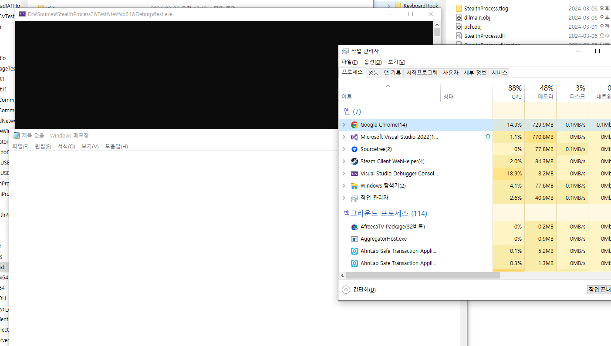

# StealthProcess2

원래는 CreateProcessA(W)를 후킹하여 자식프로세스로 생성되는 작업관리자 또는 ProcExp64.exe 자식프로세스에 dll 주입시키는 프로젝트 였으나, CreateProcess를 사용하여 더이상 자식프로세스를 만들지 않는 점에서 DLL 인젝션 실패 프로세스를 감지하여, 프로세스가 생길 때, 작업관리자이면 스텔스 DLL 인젝션 시키는 파일 업데이트